# Introduction

Algorithmic trading has become a buzzword. More and more people seem to be entering this fast growing domain.  But what makes a good trading algo? In this project we will seek to compare two models to see which is better at predicting the market. We will use fundamental ecomnomic indicators in one model which we will call our "trend" model and technical indicators for the other model, which we will refer to as our "trade" model.


# Core Message
Predicting stock market returns using economic indicators creates a more reliable model than a model based on technical indicators.


# Trend Model
***_Project Goal:_*** to build a Machine Learning Model using fundamental economic inputs to predict monthly S&P500 returns. Then using this model, we will build an algorithmic trading strategy aiming to outperform the S&P500 return.

## Summary
We employed several Machine Learning Algorithms to build an effective Algorithmic Trading strategy that would buy and sell the SPY ETF. We used several fundamental indicators on a one month lag as features for our Machine Learning models and then made buy and sell decisions based on the model's predictions for next months one-month return. Shown below is the cumulative return of several models we used and the benchmark return over that same time period.

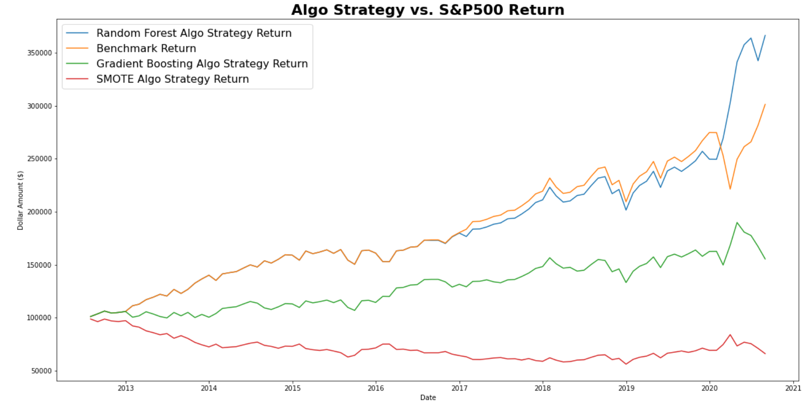

## Process

1. Use the API from the St.Louis Federal Reserve website to pull several fundamental economic indicators to be used as features in our model.
2. Data Preparation: clean and prepare the data to be inputted as features.
3. Use the Yahoo Finance API to pull several other features and our y-variable data (SP500 monthly returns). Use the SPY prices to then calculate monthly returns.
4. Concat all the data into a signal DataFrame.
5. Split, train and test the data.
6. Use the ML model predictions as buy/sell decision in algo strategy
7. Evaluate model performance using an initial investment of $100,000 and compare to the benchmark return (the SP500 return).

## Feature Selection
 
Below is the list of the final features we used to build our model:

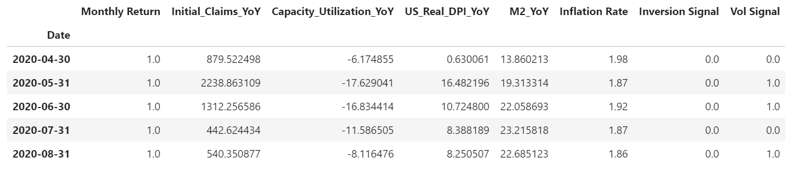

Below is an explanation of each feature:

***Monthly Return***

This is our y variable. This is the monthly return of the S&P500 index (we used the SPY etf as a proxy). We've set this as a classification problem by labelling each monthly return as either 'positive' or 'negative' - positive return months labelled as 1 and negative return months labelled as 0.

***Initial Claims YoY Change***

This is our first feature and refers to  weekly unemployment initial claims made in the US. An initial jobless claim is made by an umemployed US citizen and is made to request a determination of whether the individual is eligible for Unemployment Insurance. Because this data is collected weekly we resampled the data to sum for a monthly total and then we compared each period to the same time period a year prior in order to come to a Year-over-Year (YoY) percentage change figure.

***Capacity Utilization YoY***

This feature refers to the 'Capacity Utilization: Total Industry' and is the percentage of resources used by corporations and factories to produce goods in manufacturing, mining, and electric and gas utilities for all facilities located in the United States (excluding those in U.S. territories). Simply this is the percentage of capacity that is being used in the economy from the total possible capacity in order to produce demanded finished products. Again, we calculated the YoY change and used this as our final feature in the model.

***US Real DPI YoY***

This feature refers to the Real Disposable Income in the US. Again, we calculated the YoY change and used this as our final feature in the model.

***M2 YoY***

This feature refers to M2 Money stock, which is reported weekly by the Board of Governors of the Federal Reserve System, in Billions, adjusted for seasonality. M2 includes a broader set of financial assets held principally by households. M2 consists of M1 plus: (1) savings deposits (which include money market deposit accounts, or MMDAs); (2) small-denomination time deposits (time deposits in amounts of less than $100,000); and (3) balances in retail money market mutual funds (MMMFs). Seasonally adjusted M2 is computed by summing savings deposits, small-denomination time deposits, and retail MMMFs, each seasonally adjusted separately, and adding this result to seasonally adjusted M1.

***Inflation Rate***

For the inflation rate we used the Trimmed Mean PCE inflation rate, which is produced by the Federal Reserve Bank of Dallas. This is an alternative measure of core inflation in the price index for personal consumption expenditures (PCE). Below is the explanation from the Federal Reserve Bank of Dallas on the process of calculating this measure of inflation:

_"Calculating the trimmed mean PCE inflation rate for a given month involves looking at the price changes for each of the individual components of personal consumption expenditures. The individual price changes are sorted in ascending order from “fell the most” to “rose the most,” and a certain fraction of the most extreme observations at both ends of the spectrum are thrown out or trimmed. The inflation rate is then calculated as a weighted average of the remaining components. The trimmed mean inflation rate is a proxy for true core PCE inflation rate. The resulting inflation measure has been shown to outperform the more conventional “excluding food and energy” measure as a gauge of core inflation."_

***Inversion Signal***

This refers to whether or not the US 10 Yr Treasury Bond yield as crossed below the US 2 Yr Treasury Yield. This is often believed to be a bearish signal and in fact has preceded every US recession over the last 50 years. 
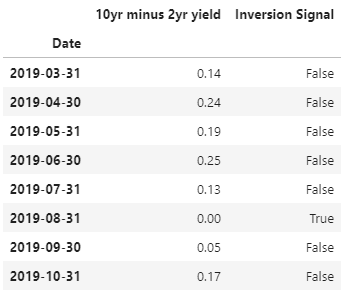


Below is how we went about calculating the signal:
```
# Clean Yield Curve data: feature (8 of 8)
clean_data(US_yield_curve, "10yr minus 2yr yield")

# Construct the dependent variable where if monthly return is greater than 0, then 1, else, 0.

US_yield_curve['Inversion Signal'] = np.where(US_yield_curve['10yr minus 2yr yield'] < 0, 1.0, 0.0)

# Clean Yield Curve data 

US_yield_curve = US_yield_curve.resample('M').agg({'10yr minus 2yr yield':'last', 'Inversion Signal':np.any})

# Final US yield curve data

US_yield_curve["Inversion Signal"] = US_yield_curve["Inversion Signal"].astype(int)
```
***Vol Signal***

This refers to a volatility signal we used to help the model better predict negative percentage return periods. Below is the code we used to calculate this signal. Essentially we pulled daily VIX prices (this is an index that tracks the volatility of S&P 500 index options and is commonly referred to as 'Wall Street's Fear Index'). To calculate the signal we simply compared each month's closing price to the previous month and if the Volatility in the current month was lower than the previous month we assigned the signal a 1 value. 

```
# Download VIX data

VIX_df = download_data(['^VIX'], "1980-01-01")
VIX_df.head()

# Clean Vix DF data and calculate monthly returns

VIX_resampled = VIX_df.resample('M').last()
VIX_resampled["VIX Monthly Return"] = VIX_resampled['Adj Close'].pct_change() * 100
VIX_resampled = VIX_resampled.dropna()
VIX_resampled["Vol Signal"] = np.where(VIX_resampled['Adj Close'] < VIX_resampled['Adj Close'].shift(1), 1.0,0.0)
VIX_resampled.tail(20)
```
## Building the Machine Learning Model

### Random Forest ML Model

Below is the confusion matrix for the Random Forest model.

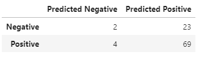

The accuracy score overall for the model was 72%, however as you can see from the confusion matrix the model was heavily biased towards predicting positive monthly returns. 

Below is a graphical representation of the features ordered by importance to our model:


Interesting note about our features is that although the volatility signal was weighted low in the features importance chart above after adding the vol signal feature to the model the model successfully predicted the sharp decline in the S&P500 during 2020 February and March time period. 

### Gradient Boosting ML Model

Below is the confusion matrix for the Gradient Boosting Classifier:

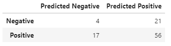

The accuracy score overall for the Gradient Boosting model was 61%. Similar to the Random Forest model, the model struggled to predict the minority class (negative return months), scoring just slightly better with a 16% recall score for the minority class. However this came at the expense of significantly poorer score for predicting the majority class (positive return months) with a recall score of 77% vs 95% for the Random Forest model. The Imbalanced Classification Report for both models is shown below:

***Random Forest Imbalanced Classification Report***

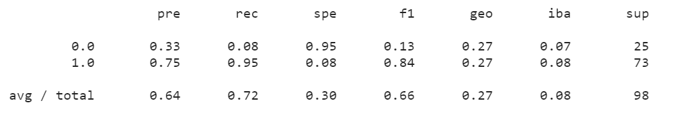

***Gradient Boosting Imbalanced Classification Report***

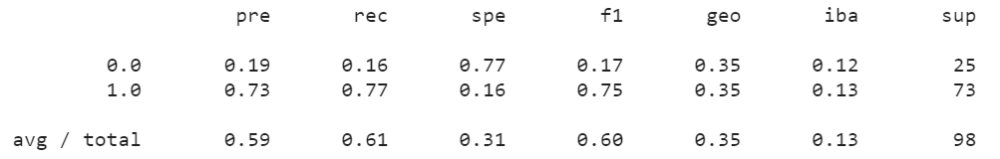


### Model Evaluation using Matthew's Correlation Coefficient (MCC)

***Random Forest MCC Score*** = 0.0458

***Gradient Boosting MCC Score*** = -0.0774

The Matthews Correlation Coefficient is a widely used in Machine Learning to evaluate the strength of one's model. The MCC is a balanced measure of the predictive power of a model and is well suited to classification problems with classes of different sizes (as in our case here between positive and negative return months). Generally, a perfect score of +1 indicates perfect correlation between the model output and the actual, whereas a -1 score indicates total inverse correlation. A score of 0 would imply the model is no better than a random prediction.

## Building The Algorithmic Trading Strategy

The strategy is simply to buy (or hold) the SPY etf if the model indicates next month's return will be positive and to short the etf if the model predicts that next month's return will be negative. Below is the last 12 predictions for each of the models, as well as the actual percentage return over those periods.


Finally to visualize the performance of each model vs the benchmark (the S&P500 return), I calculated the cumulative return for each model (assuming an initial capital investment of $10000). The code is shown below:

```
initial_capital = 100000


cumulative_RF_capital = initial_capital * (1 + (Results['Percentage Return'] * Results['Random Forest Predicted Value'])).cumprod()

benchmark_return = initial_capital * (1+(Results['Percentage Return'])).cumprod()

cumulative_gradient_return = initial_capital * (1 + (Results['Percentage Return'] * Results['Gradient Boost Predicted Value'])).cumprod()

cumulative_SMOTE_return = initial_capital * (1 + (Results['Percentage Return'] * Results['SMOTE Predicted Value'])).cumprod()
```

### Algo Strategy Performance Evaluation

Shown below is the cumulative return of the models vs the benchmark over the test data set period. (Note this is the same chart shown above in the summary section):


Only the Random Forest Algo strategy outperformed the benchmark, and all of that outperformance was derived from 2020. The model accurately predicted February and March would be negative return months, which also happened to be large drawdown months of -8% and -12% respectively. The model than had us buy back into the market at the lows of early April, helping us capture most of the strong equity recovery during the summer months. The other two models both underperformed the benchmark quite significantly. Interestingly the Gradient Boosting model also predicted the negative return in March of 2020, however the model also called on us to continuing shorting the market through the strong equity gains of May 2020 through to end of July.

***Why do the models predict different results in 2020?***

Fundamental economic data has been extremely weak due to the COVID-19 outbreak and the subsequent economic shutdown in the US. Looking at our features, Capacity Utilization and Jobless Claims have fully reflected the scale of the economic damage caused by the outbreak. Therefore models that do a better job of handling imbalanced data (SMOTE and Gradient Boosting), were more likely to associate this fundamental economic deterioration to prior periods of negative stock returns. Whereas the Random Forest model likely continued to overweight the majority class, thereby predicting positive stock returns in April, May and June.

However, our features also reflected the extraordinary stimulus provided by the US Federal Government and the US Federal Reserve (US Disposable Income and M2 actually increased in February and March). Therefore, unlike prior recessions the usual economic signals that would precipitate a downturn in US equities have clearly been disrupted. Therefore we suspect that the SMOTE Oversampling and Gradient Boosting models were simply reflecting this reality. In other words, as equity returns and economic fundamentals diverged in 2020, our models built on economic fundamentals (particularly those overweighted to predict negative monthly returns) struggled to accurately track the stock market.


# Trade Model

## Process
​
1. Download stock prices data ((1993- present)) from yahoo finance for ticker "SPY"  
2. Select column for closing prices and calculated "Daily returns"


## Feature Selection

We constructed the features, based on the following three calculations:
​
* (1) Exponential Moving Average of Closing Prices, used to calculate our first Feature, which is the  **"crossover_signal"**.  For this we used a short_window of 50 and a long_window of 200

Plot of Exponential Moving Average of Closing Prices 
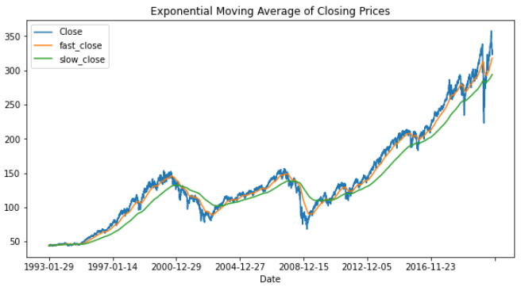


* (2) Exponential Moving Average of Daily Return Volatility,  used to calculate our second feature, which is **"vol_trend_signal"**'  For this we used a short_window of 50 and a long_window of 200


Plot of Exponential Moving Average of Daily Return Volatility 


* (3) Bollinger Bands, used to calculate our third signal, which is **"bollinger_signal"**.  For this we used a window of 20  

Plot of Bollinger Bands


Below is the list of the final features we used to build our models
These features will be used to predict whether the market will have a positive or negative return the following day

- X Features


### Creating the model

We used 70% of or data as the training data and 30% for testing. (Trained on 19 years; Tested on 8 years)
The data was fitted and trained using 3 different models for comparison:
* Random Forrest Classifier (RFC)
* Gradient Boosting Classifier (GBC)
* Support Vector Machine (SVM)


### Model evaluations:

All 3 models had an accuracy score of just over 50% with a bias toward the positive class.  In fact, both the RFC and the GBC returned identical results for all 3 matrices below.

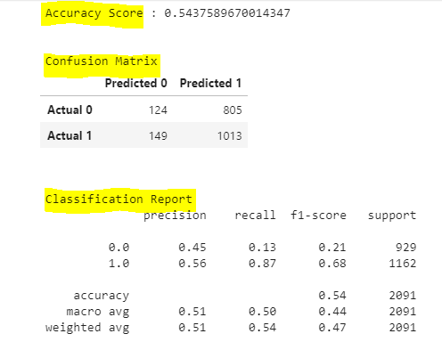

The SVM showed a slightly better accuracy score however it was unable to predict anything in the negative class, as seen in the confusion matrix:


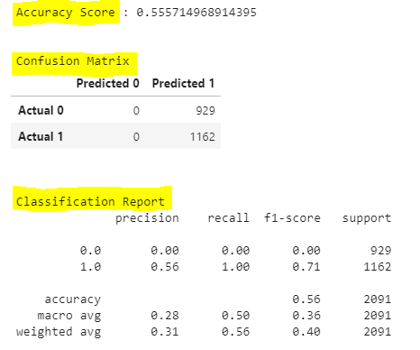


### New evaluation metric : Matthew Correlation Coefficient score
- RFC : 0.007742193629239456
- SVM : 0.00 (This implies the model is no better than a random prediction).


Although the SVM had a higher accuracy score, based on the MCC score, the RFC would still be considered a better model.


Below is the cumulative returns of the RFC models vs the benchmark over the test data set period.  For the most part it is on par with the index, however eventually, the index ends up slighly better.

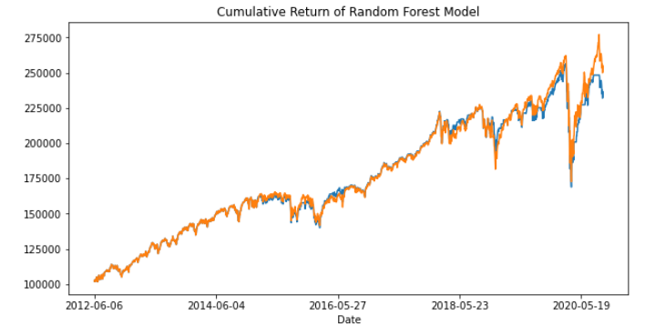

# Conclusions
 If we compare the best performing "Trade" model with the best performing "Trend" model, we can conclude that the model based on economic indicators, is better at predicting the direction of the market.

