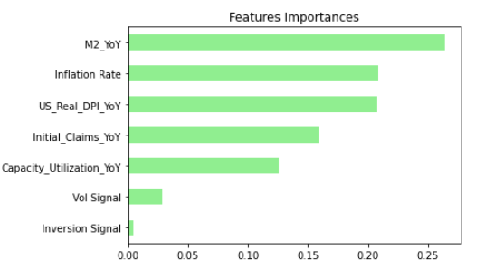
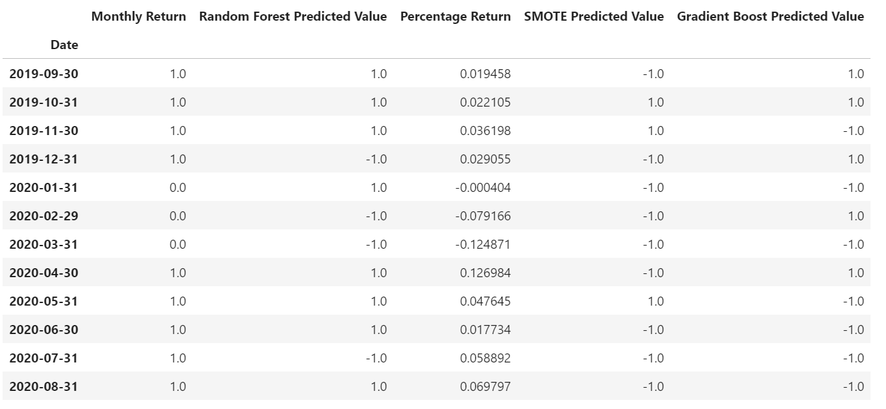

# Trend Model
***_Project Goal:_*** to build a Machine Learning Model using fundamental economic inputs to predict monthly S&P500 returns. Then using this model, we will build an algorithmic trading strategy aiming to outperform the S&P500 return.

## Summary
We employed several Machine Learning Algorithms to build an effective Algorithmic Trading strategy that would buy and sell the SPY ETF. We used several fundamental indicators on a one month lag as features for our Machine Learning models and then made buy and sell decisions based on the model's predictions for next months one-month return. Shown below is the cumulative return of several models we used and the benchmark return over that same time period.


## Process

1. Use the API from the St.Louis Federal Reserve website to pull several fundamental economic indicators to be used as features in our model.
2. Data Preparation: clean and prepare the data to be inputted as features.
3. Use the Yahoo Finance API to pull several other features and our y-variable data (SP500 monthly returns). Use the SPY prices to then calculate monthly returns.
4. Concat all the data into a signal DataFrame.

### Feature Selection

Below is the list of the final features we used to build our model:


Below is an explanation of each feature:

***Monthly Return***
This is our y variable. This is the monthly return of the S&P500 index (we used the SPY etf as a proxy). We've set this as a classification problem by labelling each monthly return as either 'positive' or 'negative' - positive months labelled as 1 and negative return months labelled as 0.

***Initial Claims YoY Change***
This is our first feature and refers to the weekly unemployment initial claims made in the US. An initial jobless claim is a made by an umemployed US citizen and is made to request a determination of whether the individual is eligible for Unemployment Insurance. Because this data is collected weekly we resampled the data to sum for a monthly total and then we compared each period to the same time period a year prior in order to come to a Year-over-Year (YoY) figure.

***Capacity Utilization YoY***
This feature refers to the 'Capacity Utilization: Total Industry' and is the percentage of resources used by corporations and factories to produce goods in manufacturing, mining, and electric and gas utilities for all facilities located in the United States (excluding those in U.S. territories). Simply this is the percentage of capacity that is being used in the economy from the total possible capacity in order to produce demanded finished products. Again, we calculated the YoY change and used this as our final feature in the model.

***US Real DPI YoY***
This feature refers to the Real Disposable Income in the US. Again, we calculated the YoY change and used this as our final feature in the model.

***M2 YoY***
This feature refers to M2 Money stock, which is reported weekly by the Board of Governors of the Federal Reserve System, in Billions, adjusted for seasonality. M2 includes a broader set of financial assets held principally by households. M2 consists of M1 plus: (1) savings deposits (which include money market deposit accounts, or MMDAs); (2) small-denomination time deposits (time deposits in amounts of less than $100,000); and (3) balances in retail money market mutual funds (MMMFs). Seasonally adjusted M2 is computed by summing savings deposits, small-denomination time deposits, and retail MMMFs, each seasonally adjusted separately, and adding this result to seasonally adjusted M1.

***Inflation Rate***
For the inflation rate we used the Trimmed Mean PCE inflation rate, which is produced by the Federal Reserve Bank of Dallas. This is an alternative measure of core inflation in the price index for personal consumption expenditures (PCE). Below is the explanation from the Federal Reserve Bank of Dallas on the proces of calculating this measure of inflation:

_"Calculating the trimmed mean PCE inflation rate for a given month involves looking at the price changes for each of the individual components of personal consumption expenditures. The individual price changes are sorted in ascending order from “fell the most” to “rose the most,” and a certain fraction of the most extreme observations at both ends of the spectrum are thrown out or trimmed. The inflation rate is then calculated as a weighted average of the remaining components. The trimmed mean inflation rate is a proxy for true core PCE inflation rate. The resulting inflation measure has been shown to outperform the more conventional “excluding food and energy” measure as a gauge of core inflation."_

***Inversion Signal***

This refers to whether or not the US 10 Yr Treasury Bond yield as crossed below the US 2 Yr Treasury Yield. This is often believed to be a bearish signal and in fact has preceded every US recession over the last 50 years. Below is how we went about calculating the signal:
```
# Clean Yield Curve data: feature (8 of 8)
clean_data(US_yield_curve, "10yr minus 2yr yield")

# Construct the dependent variable where if monthly return is greater than 0, then 1, else, 0.

US_yield_curve['Inversion Signal'] = np.where(US_yield_curve['10yr minus 2yr yield'] < 0, 1.0, 0.0)

# Clean Yield Curve data 

US_yield_curve = US_yield_curve.resample('M').agg({'10yr minus 2yr yield':'last', 'Inversion Signal':np.any})

# Final US yield curve data

US_yield_curve["Inversion Signal"] = US_yield_curve["Inversion Signal"].astype(int)
```
***Vol Signal***
This refers to a volatility signal we used to help the model better predict negative percentage return periods. Below is the code we used to calculate this signal. Essentially we pulled daily VIX prices (this is a index that tracks the volatility of the S&P 500 and is commonly referred to as 'Wall Street Fear Index'). Then to calculate the signal we simply compared each monthly end price to the previous month and if the Volatility in the current month is lower than the previous month we assigned the signal a 1 value. 

```
# Download VIX data

VIX_df = download_data(['^VIX'], "1980-01-01")
VIX_df.head()

# Clean Vix DF data and calculate monthly returns

VIX_resampled = VIX_df.resample('M').last()
VIX_resampled["VIX Monthly Return"] = VIX_resampled['Adj Close'].pct_change() * 100
VIX_resampled = VIX_resampled.dropna()
VIX_resampled["Vol Signal"] = np.where(VIX_resampled['Adj Close'] < VIX_resampled['Adj Close'].shift(1), 1.0,0.0)
VIX_resampled.tail(20)
```
## Building the Machine Learning Model

### Random Forest ML Model

Below is the confusion matrix for the Random Forest model.


The accuracy score overall for the model was 74%, however as you can see from the confusion matrix the model was heavily biased towards predicting positive monthly returns. 

Below is a graphical representation of the features ordered by importance to our model:



Interesting note about our features is that although the volatility signal was weighted low in the features importance chart above after adding the vol signal feature to the model the model succesfully predicted the sharp decline in the S&P500 during 2020 February and March time period. 

### Gradient Boosting ML Model

Below is the confusion matrix for the Gradient Boosting Classifier:


The accuracy score overall for the Gradient Boosting model was 62%. Similar to the Random Forest model, the model struggled to predict the minority class (negative return months), scoring just slightly better with just a 16% recall score for the minority class. However this came at the expense of significantly poorer score for predicting the majority class (positive return months) with a recall score of 78% vs 96% for the Random Forest model. The Imbalanced Classification Report for both models is shown below:

***Random Forest Imbalanced Classification Report***


***Gradient Boosting Imbalanced Classification Report***


### Model Evaluation using Matthew's Correlation Coefficient (MCC)

***Random Forest MCC Score*** = 0.0758

***Gradient Boosting MCC Score*** = -0.0673

The Matthews Correlation Coefficient is a widely used in Machine Learning to evaluate the strength of one's model. The MCC is a balanced measure of the predictive power of a model and is well suited to classification problems with classes of different sizes (as in our case here between positive and negative return months). Generally, a perfect score of +1 indicates perfect correlation between the model output and the actual, whereas a -1 score indicates total inverse correlation. A score of 0 would imply the model is no better than a random prediction.

## Building The Algorithmic Trading Strategy

The strategy is simply to buy (or hold) the SPY etf if the model indicates next month's return will be positive and to short the etf if the model predicts that next month's return will be negative. Below is the last 20 predictions for each of the models, as well as the actual percentage return over those periods.



Finally to visualize the performance of each model vs the benchmark (the S&P500 return), I calculated the cumulative return for each model (assuming an initial capital investment of $10000). The code is shown below:

```
initial_capital = 100000


cumulative_RF_capital = initial_capital * (1 + (Results['Percentage Return'] * Results['Random Forest Predicted Value'])).cumprod()

benchmark_return = initial_capital * (1+(Results['Percentage Return'])).cumprod()

cumulative_gradient_return = initial_capital * (1 + (Results['Percentage Return'] * Results['Gradient Boost Predicted Value'])).cumprod()

cumulative_SMOTE_return = initial_capital * (1 + (Results['Percentage Return'] * Results['SMOTE Predicted Value'])).cumprod()
```

### Algo Strategy Performance Evaluation

Shown below is the cumulative return of the models vs the benchmark over the test data set period. (Note this is the same chart shown above in the summary section):


Only the Random Forest Algo strategy outperformed the benchmark, and all of that outperformance was from 2020. The model accurately predicted February and March would be negative return months, which also happened to be large drawdown months of -8% and -12% respectively. The model than had us buy back into the market at the lows of early April, helping us capture the strong equity recovery from April through to end of July. The other two models both underperformed the benchmark quite significantly. Interestingly the Gradient Boosting model also predicted the negative return in March of 2020, however the model also called on us to continuing shorting the market through the strong equity gains of May 2020 through to end of July.